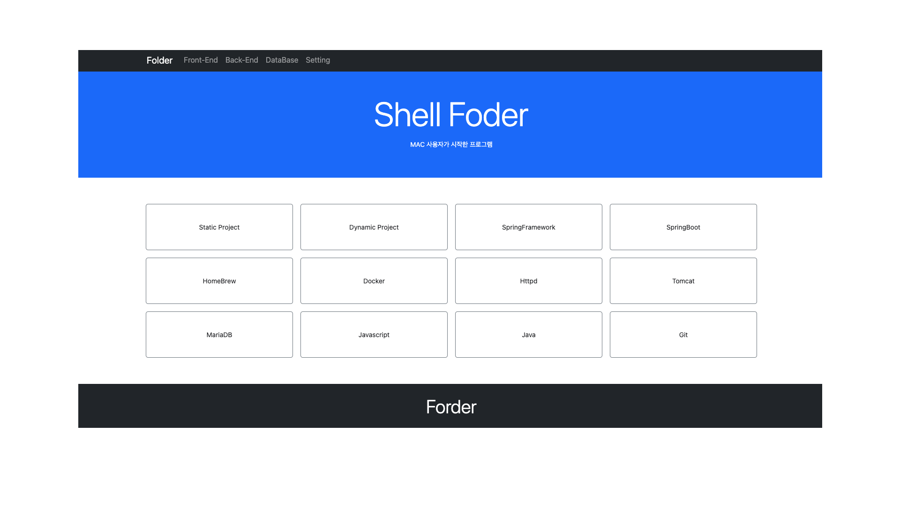

# Settings
Mac Setting

### 참조 자료 링크
> * [OpenJDK](https://www.azul.com/downloads/?version=java-19-sts&os=macos&architecture=arm-64-bit&package=jdk)
> * [node.js](https://nodejs.org/en/)
> * [Docker](https://www.docker.com/)
> * [Mariadb](https://mariadb.org/)
> * [DBeaver](https://dbeaver.io/)
> * [Eclipse](https://www.eclipse.org/)
> * [Apache](https://apache.org/)

# MAC 사용자가 시작한 프로그램
### 0. Shell Foder
</img>
----

# Table of Contents
#### 0. Shell Foder
##### [1. Java](./page/java)
##### [2. NodeJs](./page/node)
##### [3. Docker](./page/docker)
##### [4. MariaDB](./page/mariadb)
##### [5. DBeaver](./page/dbeaver)
##### [6. Eclipse](./page/eclipse)
##### [7. Httpd](./page/httpd)
##### [8. Tomcat](./page/tomcat)