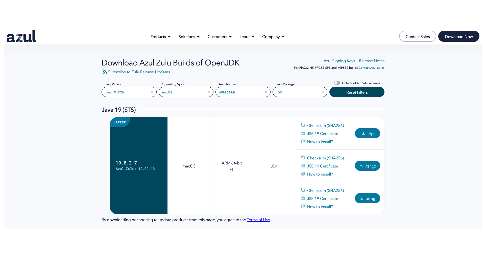

# Settings
Mac Setting

### 참조 자료 링크
> * [OpenJDK]([https://jdk.java.net/archive/](https://www.azul.com/downloads/?version=java-19-sts&os=macos&architecture=arm-64-bit&package=jdk))
> * [node.js](https://nodejs.org/en/)
> * [Docker](https://www.docker.com/)
> * [Mariadb](https://mariadb.org/)
> * [DBeaver](https://dbeaver.io/)
> * [Eclipse](https://www.eclipse.org/)
> * [Apache](https://apache.org/)

# 프로그래밍 언어 설치
### 1. Java
</img>

----

### 2. node.js
```
    brew install node
```
