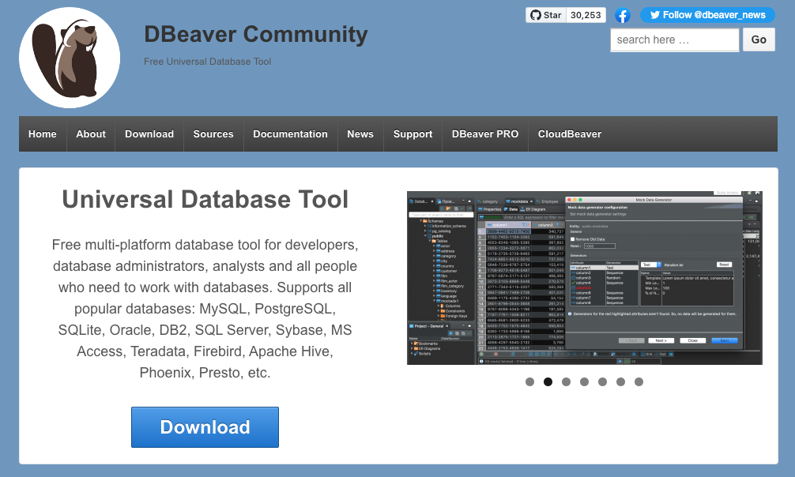
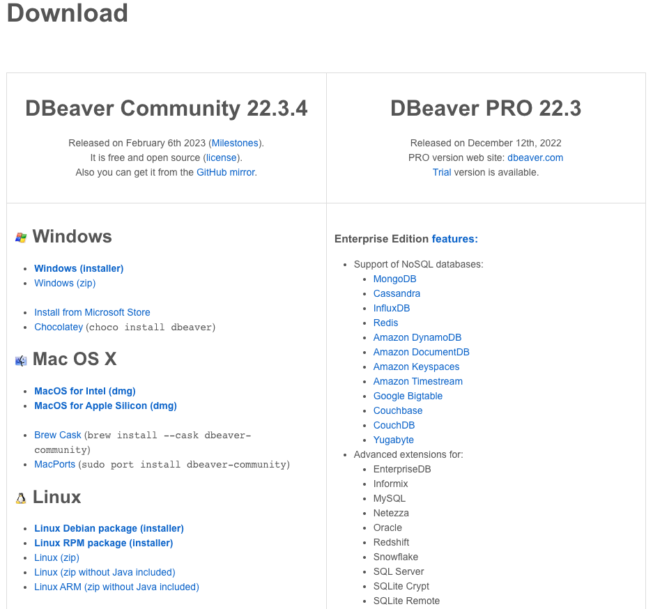
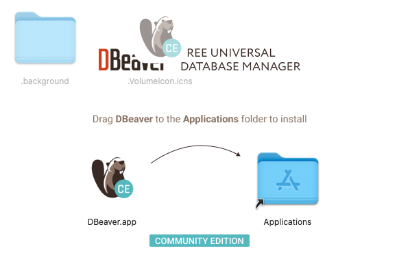
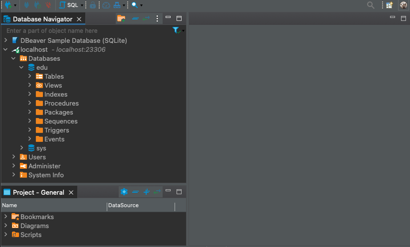

### 참조 자료 링크

> - [DBeaver](https://dbeaver.io/)

# Database Client

### 5. DBeaver

</img>

###### DBeaver 페이지에서 Download 클릭

</img>

###### Operating System(OS)에 맞는 파일 선택

</img>

###### dmg 파일 받았을 경우 dmg 실행 후 Applications로 복사

</img>

###### DBeaver 실행 시 창 활성화

</img>

##### YouTube Link

## 

---

# Table of Contents

##### [0. Shell Foder](../../../../)

##### [1. Java](../java)

##### [2. NodeJs](../node)

##### [3. Docker](../docker)

##### [4. MariaDB](../mariadb)

#### 5. DBeaver

##### [6. Eclipse](../eclipse)

##### [7. Httpd](../httpd)

##### [8. Tomcat](../tomcat)
