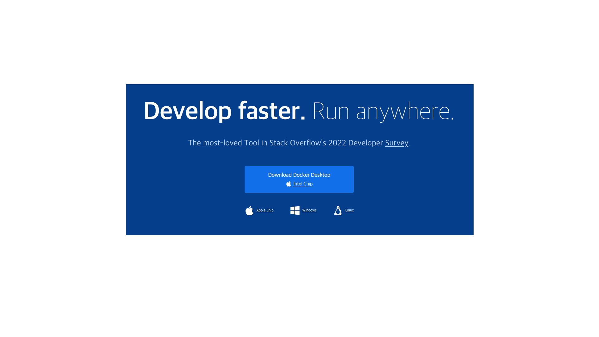
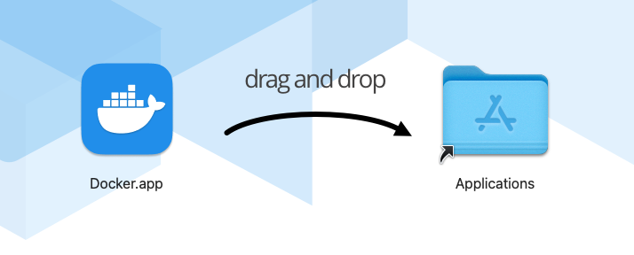
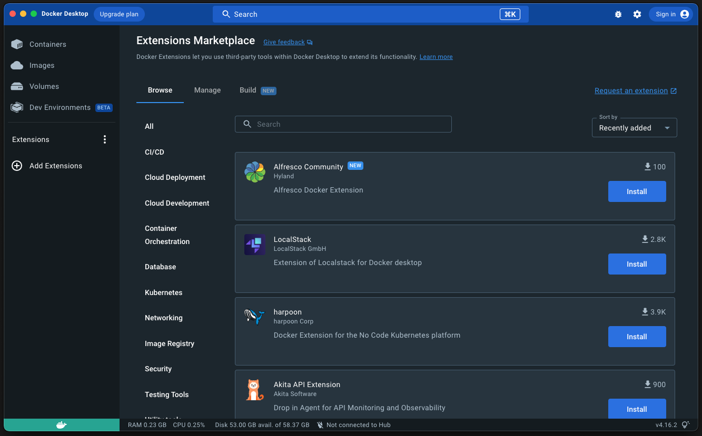
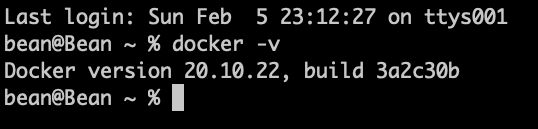

### 참조 자료 링크

> - [Docker](https://www.docker.com/)

# Operating System(OS), Runtime Container Platform

### 3. Docker

</img>

###### Download 눌러 설치 파일 받기

</img>

###### 다운 받은 dmg 파일 실행 후 Applications로 복사

</img>

###### Dashboard 실행하여 설치 상태 확인

</img>

###### 설치 후 Docker 버젼 확인

</img>

```
    docker -v
```

##### YouTube Link

## [](https://youtu.be/_lEQlgFijc4)

---

# Table of Contents

##### [0. Shell Foder](../../../../)

##### [1. Java](../java)

##### [2. NodeJs](../node)

#### 3. Docker

##### [4. MariaDB](../mariadb)

##### [5. DBeaver](../dbeaver)

##### [6. Eclipse](../eclipse)

##### [7. Httpd](../httpd)

##### [8. Tomcat](../tomcat)
