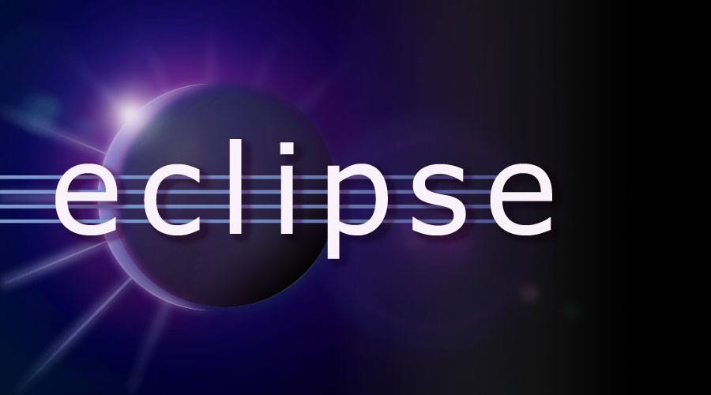

# Settings
Mac Setting

### 참조 자료 링크
> * [OpenJDK](https://www.azul.com/downloads/?version=java-19-sts&os=macos&architecture=arm-64-bit&package=jdk)
> * [node.js](https://nodejs.org/en/)
> * [Docker](https://www.docker.com/)
> * [Mariadb](https://mariadb.org/)
> * [DBeaver](https://dbeaver.io/)
> * [Eclipse](https://www.eclipse.org/)
> * [Apache](https://apache.org/)

# 통합 개발 환경(Integrated Development Environment, IDE)
### 6. Eclipse
</img>

----

# Table of Contents
##### [0. Shell Foder](../../)
##### [1. Java](../java)
##### [2. NodeJs](../node)
##### [3. Docker](../docker)
##### [4. MariaDB](../mariadb)
##### [5. DBeaver](../dbeaver)
#### 6. Eclipse
##### [7. Httpd](../httpd)
##### [8. Tomcat](../tomcat)