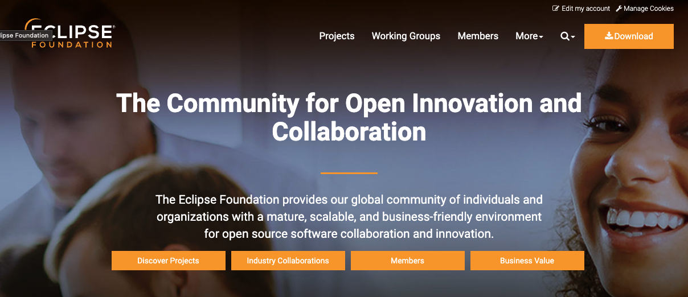
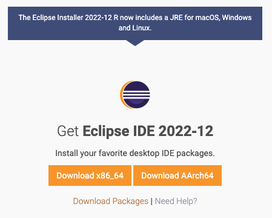
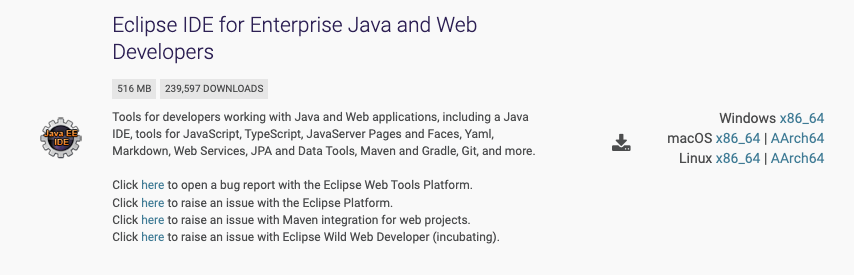
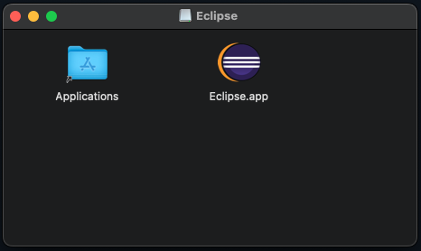
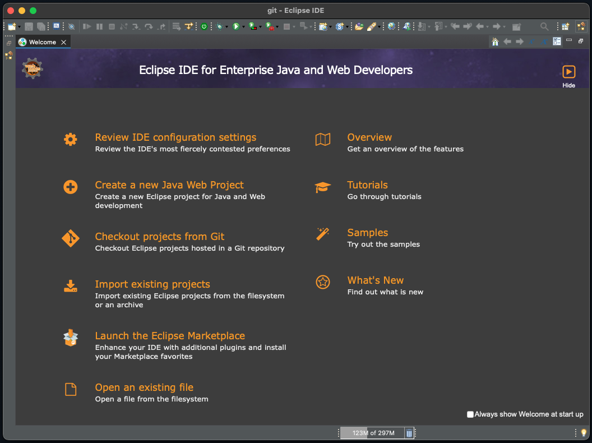

### 참조 자료 링크
> * [Eclipse](https://www.eclipse.org/)

# 통합 개발 환경(Integrated Development Environment, IDE)
### 6. Eclipse
</img>

###### Eclipse 페이지에서 Download 클릭
</img>

###### 선택으로 다운로드 하기 위하여 Download Packages 클릭
</img>

###### Eclipse IDE for Enterprise Java and Web Developers 중
###### Operating System(OS)에 맞는 파일 선택
</img>

###### dmg 파일 받았을 경우 dmg 실행 후 Applications로 복사
</img>

###### Eclipse 실행 시 창 활성화
</img>

----

# Table of Contents
##### [0. Shell Foder](../../../../)
##### [1. Java](../java)
##### [2. NodeJs](../node)
##### [3. Docker](../docker)
##### [4. MariaDB](../mariadb)
##### [5. DBeaver](../dbeaver)
#### 6. Eclipse
##### [7. Httpd](../httpd)
##### [8. Tomcat](../tomcat)
