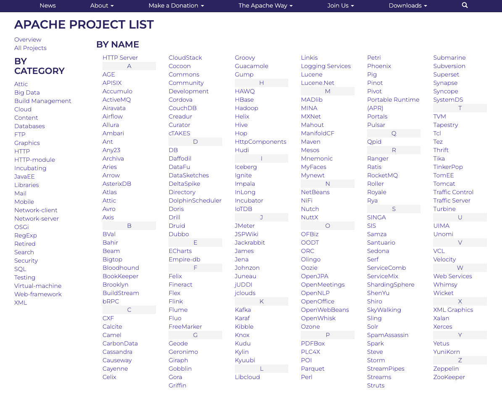
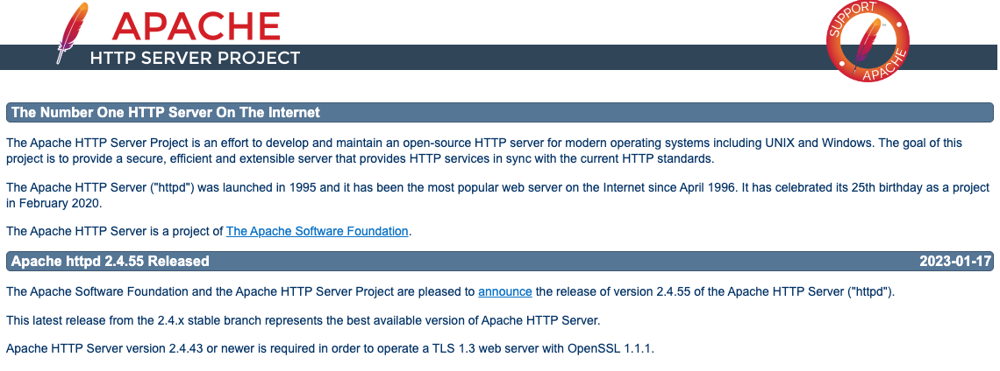

### 참조 자료 링크
> * [Apache](https://apache.org/)
> * [Apache Project](https://apache.org/index.html#projects-list)
> * [Http Server](https://httpd.apache.org/)
> * [Homebrew](https://brew.sh/index_ko)

# HTTP (Hypertext Transfer Protocol Daemon)
### 7. Httpd
</img>

###### Apache Project List (Http Server -> httpd)
</img>

###### Http Server 선택 시 정보 화면으로 이동
</img>

###### Homebrew를 이용하여 Httpd 설치
```
    sudo brew install httpd
```

###### Homebrew를 이용하여 Httpd 실행
```
    brew services start httpd
```

###### Homebrew를 이용하여 Httpd 정지
```
    brew services stop httpd
```

###### Homebrew를 이용하여 Httpd 다시 실행
```
    brew services restart httpd
```

----

# Table of Contents
##### [0. Shell Foder](../../../../)
##### [1. Java](../java)
##### [2. NodeJs](../node)
##### [3. Docker](../docker)
##### [4. MariaDB](../mariadb)
##### [5. DBeaver](../dbeaver)
##### [6. Eclipse](../eclipse)
#### 7. Httpd
##### [8. Tomcat](../tomcat)