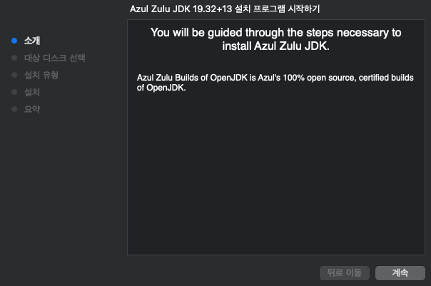
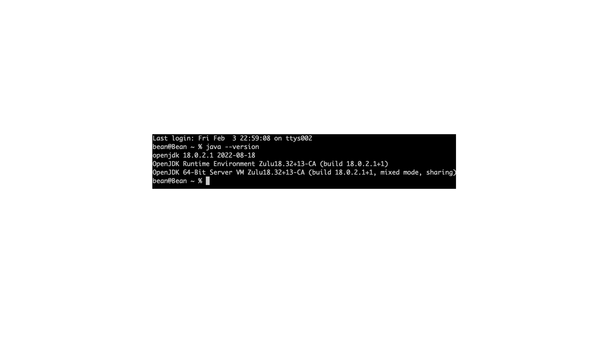

# Settings
Mac Setting

### 참조 자료 링크
> * [OpenJDK](https://www.azul.com/downloads/?version=java-19-sts&os=macos&architecture=arm-64-bit&package=jdk)
> * [node.js](https://nodejs.org/en/)
> * [Docker](https://www.docker.com/)
> * [Mariadb](https://mariadb.org/)
> * [DBeaver](https://dbeaver.io/)
> * [Eclipse](https://www.eclipse.org/)
> * [Apache](https://apache.org/)

# 프로그래밍 언어 설치
### 1. Java
</img>
```
   - Java Version       : Java 19 (STS)
   - Operating System   : macOS
   - Architecture       : ARM 64-bit (M1 or M2) / x86 64-bit (Inter Chip)
   - Java Package       : JDK (java development kit)
```
###### 다운로드 파일명 : zulu19.32.13-ca-jdk19.0.2-macosx_aarch64.dmg
###### 다운 받은 dmg 파일 실행
</img>
###### 계속 눌러서 설치
</img>
###### 설치 후 java 버젼 확인
```
    java --version
```
</img>

----

# Table of Contents
##### [0. Shell Foder](../../)
#### 1. Java
##### [2. NodeJs](../node)
##### [3. Docker](../docker)
##### [4. MariaDB](../mariadb)
##### [5. DBeaver](../dbeaver)
##### [6. Eclipse](../eclipse)
##### [7. Httpd](../httpd)
##### [8. Tomcat](../tomcat)