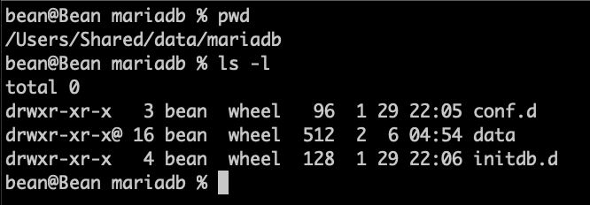

### 참조 자료 링크
> * [Mariadb](https://mariadb.org/)
> * [Docker](https://www.docker.com/)

# Datastore Storage
### 4. MariaDB
</img>

###### docker를 이용한 데이터베이스 준비
```
    Users/Shared/data/mariadb   : MariaDB 설치 Home 폴더
        ㄴ conf.d               : MariaDB 환경설정 폴더
                ㄴ conf.d       : MariaDB 환경설정 파일
        ㄴ data                 : MariaDB 데이터 저장소 폴더
        ㄴ initdb.d             : MariaDB 설치 시 실행 될 SQL문 저장 폴더

    ~/mariadb                   : docker-compose 파일 위치한 폴더
        ㄴ docker-compose.yml   : MariaDB 설정 파일 (docker용)
        ㄴ .env                 : MariaDB 설치 시 필요한 환경변수 파일
```

###### Users/Shared/data/mariadb 경로 위치한 폴더
</img>

###### my.cnf 파일 내용
```
    [client]
    default-character-set = utf8mb4

    [mysql]
    default-character-set = utf8mb4

    [mysqld]
    character-set-client-handshake = FALSE
    character-set-server           = utf8mb4
    collation-server               = utf8mb4_unicode_ci
```

###### docker-compose.yml 파일 위치한 폴더
</img>

###### docker-compose.yml 파일 내용
```
    version: "3"

    services:
    mariadb:
        image: mariadb:latest
        ports:
        - 23306:3306
        volumes:
        - /Users/Shared/data/mariadb/conf.d:/etc/mysql/conf.d
        - /Users/Shared/data/mariadb/data:/var/lib/mysql
        - /Users/Shared/data/mariadb/initdb.d:/docker-entrypoint-initdb.d
        env_file: .env
        environment:
        TZ: Asia/Seoul
        networks:
        - backend
        restart: always

    networks:
    backend:
```

###### .env 파일 내용
```
    MYSQL_HOST=localhost
    MYSQL_PORT=3306
    MYSQL_ROOT_PASSWORD=1234
    MYSQL_DATABASE=edu
    MYSQL_USER=folder
    MYSQL_PASSWORD=1234 
```

###### docker-compose.yml 실행 명령어
```
    docker-compose up -d
```

###### docker-compose.yml 정지 명령어
```
    docker-compose down
```

###### docker-compose.yml 실행 후 docker Dashboard에서 확인
</img>

----

# Table of Contents
##### [0. Shell Foder](../../../../)
##### [1. Java](../java)
##### [2. NodeJs](../node)
##### [3. Docker](../docker)
#### 4. MariaDB
##### [5. DBeaver](../dbeaver)
##### [6. Eclipse](../eclipse)
##### [7. Httpd](../httpd)
##### [8. Tomcat](../tomcat)
