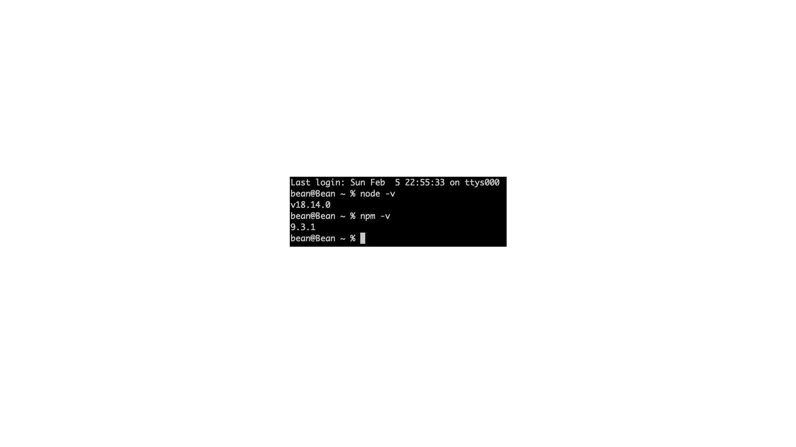

### 참조 자료 링크

> - [node.js](https://nodejs.org/en/)
> - [Homebrew](https://brew.sh/index_ko)

# 프로그래밍 언어 설치

### 2. node.js

###### Homebre를 이용하여 node 설치

```
    brew install node
```

###### 설치 후 node 및 npm 버젼 확인

```
    node -v
    npm -v
```

</img>

##### YouTube Link

## [](https://youtu.be/_lEQlgFijc4)

# Table of Contents

##### [0. Shell Foder](../../../../)

##### [1. Java](../java)

#### 2. NodeJs

##### [3. Docker](../docker)

##### [4. MariaDB](../mariadb)

##### [5. DBeaver](../dbeaver)

##### [6. Eclipse](../eclipse)

##### [7. Httpd](../httpd)

##### [8. Tomcat](../tomcat)
