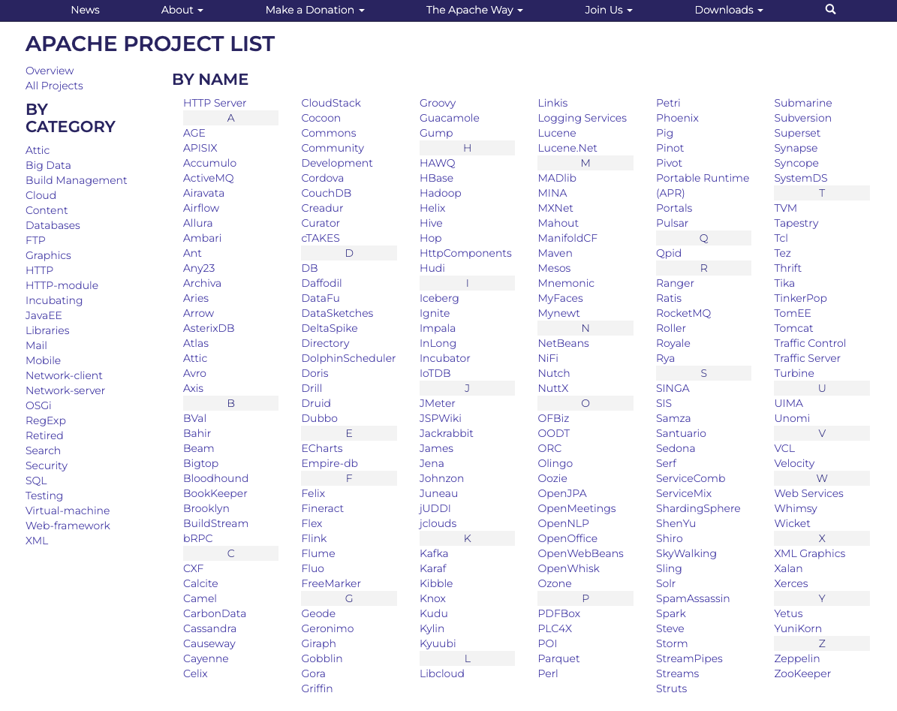

### 참조 자료 링크
> * [Apache](https://apache.org/)
> * [Apache Project](https://apache.org/index.html#projects-list)
> * [Apache Tomcat](https://tomcat.apache.org/)

# WAS (Web Application Server)
### 8. Tomcat
</img>

###### Apache Project List (Tomcat)
</img>

###### Tomcat 선택 시 정보 화면으로 이동
</img>

----

# Table of Contents
##### [0. Shell Foder](../../../../)
##### [1. Java](../java)
##### [2. NodeJs](../node)
##### [3. Docker](../docker)
##### [4. MariaDB](../mariadb)
##### [5. DBeaver](../dbeaver)
##### [6. Eclipse](../eclipse)
##### [7. Httpd](../httpd)
#### 8. Tomcat